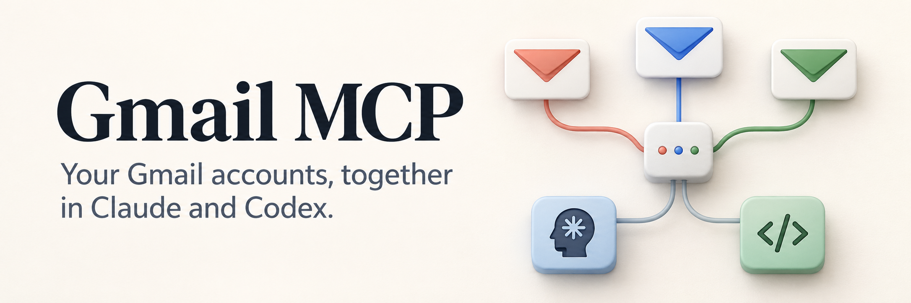
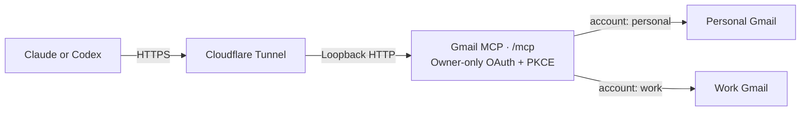

# Gmail MCP



[](LICENSE)
[](package.json)
[](#how-it-works)

Search, read, and draft across personal and work Gmail accounts through one
self-hosted MCP endpoint. Choose which accounts to connect and whether to enable
sending and label changes. Only your configured Google identity can authorize
access.

[Get started](docs/setup.md) · [Connect Claude](#connect-claude) · [Connect Codex](#connect-codex) · [Operations](#operations) · [CI](https://github.com/alexneamtu/gmail-mcp/actions/workflows/ci.yml)

> [!NOTE]
> Early release for technically experienced self-hosters. Requires Node 24,
> Linux with systemd, an HTTPS hostname, and your own Google OAuth project.
> Each deployment supports one owner with multiple Gmail accounts.

## What you can do

| Capability | Tools | Access mode |
| --- | --- | --- |
| Check connected aliases and local enrollment | `list_accounts` | Both |
| Search with Gmail queries and read messages | `search_messages`, `get_message` | Both |
| Read whole threads | `get_thread` | Both |
| List and download attachments (up to 5 MB) | `get_message`, `get_attachment` | Both |
| Look up existing labels | `list_labels` | Both |
| Create plain-text drafts in the selected mailbox | `create_draft` | Both |
| Send an existing draft | `send_draft` | Full |
| Apply or remove existing labels | `modify_message_labels` | Full |

Every tool takes an explicit `account` alias, such as `personal` or `work`.
Aliases refer to separately enrolled mailboxes. Forwarded addresses are read
through their destination mailbox; forwarding alone does not enable sending
from those addresses.

After connecting, try:

> Search `work` for unread messages from the past week and summarize the ones
> that need a reply.

> In `personal`, draft an email to friend@example.com suggesting lunch on Friday.
> Save it as a draft. Do not send it.

> [!IMPORTANT]
> Drafts mode omits the sending and label-modification tools. Google's
> `gmail.compose` scope still includes sending permission at the Google level.
> In full mode, the client must obtain your approval to send a specific draft;
> the server does not provide a separate human-approval screen for each send.

## How it works



The server uses Streamable HTTP. Google authorization enrolls each mailbox;
a separate OAuth consent flow lets Claude or Codex use those enrolled accounts.
Credentials and authorization state live in encrypted SQLite storage on your
server. The service runs as a dedicated non-root user under systemd.

Email content is untrusted input. Message bodies are capped at 60,000 characters
(200,000 per thread) with explicit truncation indicators. Attachments are
capped at 5 MB; images return as image content, other files as embedded resources. Plain text is preferred; HTML-only messages
return labelled HTML text. See the [security policy](SECURITY.md) for the trust
boundaries, logging rules, and backup limitations.

## Setup

Follow the **[step-by-step setup guide](docs/setup.md)**. It covers:

1. Building the server and configuring mailbox aliases.
2. Serving the public information pages and connecting your HTTPS hostname.
3. Creating your Google project and OAuth clients, then enrolling each account.
4. Installing the service and connecting Claude or Codex.

The information pages must be available before Google OAuth setup. The guide
uses `npm run start:setup` for this stage; the full server starts after enrollment.
Enrollment requires a browser on the server or a computer with SSH forwarding.
Phone-only enrollment is unsupported.

<details>
<summary>Setup reference for returning operators</summary>

For CLI usage, run `node dist/cli.js --help` after building. Help works before
configuration or credentials exist.

Use **Node 24**. Run `npm ci --ignore-scripts`, `npm test`, `npm run check`, and
`npm run build`. Tests use synthetic accounts and never send email. The HTTP
suite includes an actual MCP Inspector CLI connection.

Create a dedicated Google Cloud project and enable Gmail API. In Google Auth
Platform configure External audience, app/support/contact information, authorized
domain and real home/privacy/terms URLs. The server supplies `/`, `/privacy`, and
`/terms`. Publish to **In production** before enrollment, avoiding seven-day
refresh-token expiry in Testing. Personal use may remain unverified; Workspace
administrators may need to allow it.

Add `openid`, `https://www.googleapis.com/auth/userinfo.email`, and the Gmail
scope(s). Full mode needs only `https://www.googleapis.com/auth/gmail.modify`.
Drafts mode uses `gmail.readonly` plus `gmail.compose`; Google's compose scope can
also send, but the server omits its send tool in drafts mode.

Create two Google OAuth clients:

- **Desktop app**, for mailbox enrollment.
- **Web application**, for interactive owner sign-in, with exactly
  `https://mcp.example.com/login/google/callback` as redirect URI. Use your real
  domain. Leave JavaScript origins empty.

Save the client JSON files outside Git with mode `0600` in a `0700` directory.
Google shows new client secrets only at creation. Create
`~/.config/gmail-mcp/config.json` from [the example](deploy/config.example.json),
also `0600`. Then run:

```sh
node dist/cli.js init /private/google-desktop.json /private/google-web.json
node dist/cli.js enroll-owner
node dist/cli.js enroll personal
node dist/cli.js enroll work
node dist/cli.js status
```

The CLI encrypts credentials/state in `~/.local/share/gmail-mcp/state.db`, using
`~/.config/gmail-mcp/master.key`. Original JSON files remain private recovery
copies. Never commit them. For enrollment from another computer, leave this
running there and open the printed Google URL on that same computer:

```sh
ssh -N -L 18888:127.0.0.1:18888 <ssh-user>@<server>
```

Use the same computer for the browser and the SSH command. A browser running on
the server itself needs no tunnel. Opening the Google URL on a phone alone cannot
complete enrollment; phone-only enrollment is currently unsupported. The CLI
names the alias being enrolled, and the callback page confirms that alias.

Select the expected Google account and approve. Sessions last ten minutes.
Identity, verified email, state, nonce and PKCE are checked. You can close the
SSH tunnel after all enrollments succeed.

</details>

## Connect Claude

1. Open **Customize → Connectors → Add → Custom → Web**, sometimes labelled
   **Add custom connector**.
2. Enter a name and `https://mcp.example.com/mcp`, replacing the domain with yours.
3. Choose **Sign in now → Use your own OAuth client**.
4. Set the client ID to `claude-gmail`. Leave the client secret blank and add no
   fixed Authorization header.
5. Connect, sign in as your configured Google owner, approve the account
   permissions, and enable the connector in the chat menu.

Use the connector client ID above, not a Google OAuth client ID.

<details>
<summary>OAuth behavior, session lifetime, and verification</summary>

This is the connector's OAuth client, not either Google client ID. It uses code
flow with mandatory PKCE S256 and its registered callback
`https://claude.ai/api/mcp/auth_callback`. Dynamic registration and published
client identity are not enabled. Tokens require the configured owner, resource,
scope and an active grant. Refresh tokens rotate; replay revokes their grant.
Connector grants expire 30 days after creation. Refreshing tokens does not extend
that grant: reconnect and approve again when it expires. This is separate from
Google mailbox enrollment; working Gmail grants do not need re-enrollment just
because connector consent expires.

Verify in Claude: call `list_accounts` with a known alias, search every alias,
and create a clearly marked draft. Never send during validation. Local Inspector
success does not prove the production Google-to-Claude OAuth flow.

References: [Claude connectors](https://support.claude.com/en/articles/11175166-get-started-with-custom-connectors-using-remote-mcp),
[Google audience](https://support.google.com/cloud/answer/15549945),
[Google clients](https://support.google.com/cloud/answer/15549257).

</details>

## Connect Codex

The separate public OAuth client `codex-gmail` uses the same owner-only Google
login and PKCE checks. Add the following to `~/.codex/config.toml`, substituting
your domain. Preserve existing settings:

```toml
[mcp_servers.gmail]
url = "https://mcp.example.com/mcp"
scopes = ["mcp", "offline_access"]

[mcp_servers.gmail.oauth]
client_id = "codex-gmail"
callback_url = "http://127.0.0.1:18989/callback"
callback_port = 18989
```

Run `codex mcp login gmail`. For headless login, use
`codex mcp login gmail --no-browser` and follow its callback instructions.
Keep authorization codes and callback URLs out of chat and logs. Alternatively,
forward port 18989 over SSH from the browser's computer to the Codex host.
Restart your Codex session after setup and verify `list_accounts` and a search.
No Google Console changes or mailbox re-enrollment are needed. The native
client accepts loopback callback ports according to RFC 8252; the callback host
and path remain restricted. `codex mcp logout gmail` removes local authorization.
Server-side `revoke-all` revokes access for every connector client.

Reference: [Codex MCP configuration](https://learn.chatgpt.com/docs/extend/mcp?surface=cli).

## Connect Claude Code

Claude Code uses a separate public client, `claude-code-gmail`, with the exact
callback `http://localhost:18989/callback`. It requires owner login and PKCE;
there is no client secret. Do not reuse the Codex client ID: its callback uses
`127.0.0.1`, which is a different OAuth redirect URI.

Add the server in your personal Claude Code profile, substituting your domain:

```bash
claude mcp add --transport http --scope user \
  --client-id claude-code-gmail --callback-port 18989 \
  gmail-personal https://mcp.example.com/mcp
```

If `gmail-personal` already exists, update its `oauth.clientId` to
`claude-code-gmail` and `oauth.callbackPort` to `18989` in the configuration
reported by `claude mcp get gmail-personal`. Preserve its URL and other entries.
Restart Claude Code, then use `/mcp` to authenticate. If the final callback page
cannot load, paste its full URL into Claude Code's callback prompt, not a chat.
No Google Console changes or mailbox re-enrollment are needed.

Reference: [Claude Code MCP OAuth](https://code.claude.com/docs/en/mcp#use-pre-configured-oauth-credentials).

## Deployment

Use the **[install, update, and rollback guide](docs/operations.md)** for copyable
commands. The supported deployment uses systemd and a Cloudflare tunnel.

<details>
<summary>Service layout, permissions, and networking</summary>

Review [install.sh](deploy/install.sh), then run it as root with four arguments:
built checkout, Node 24 installation directory, private config directory and
state directory. Stop enrollment processes first. It refuses to overwrite an
existing installation. It creates a non-login `gmail-mcp` system user and a
[hardened systemd service](deploy/gmail-mcp.service), listening only on
`127.0.0.1:8787`, with restart on failure.

Installed code/runtime: `/opt/gmail-mcp`. Config/key: `/etc/gmail-mcp`.
Encrypted state: `/var/lib/gmail-mcp/state.db`. Secrets/state are owned by the
service account, files `0600`, directories `0700`. Code is root-owned and
read-only to the service. Original enrollment state remains a private backup;
use the installed admin command thereafter, not the development CLI defaults.

Publish the configured hostname through an existing Cloudflare tunnel with
origin `http://127.0.0.1:8787`. Cloudflare supplies edge HTTPS and encrypted tunnel
transit; the final hop stays on loopback. Preserve the public Host and forwarded
HTTPS scheme. Disable caching and request logging for this hostname. Do not put
an interactive Cloudflare Access gate in front of OAuth/MCP. Information pages
and discovery are public; all mailbox tools require OAuth.

The installer does not alter firewall/router/tunnel configuration. A tunnel
requires no new inbound ports. On a shared host, preserve existing services,
LAN and VPN access. Preserving existing public-port exceptions does not establish
an exact 22/80/443-only ingress policy; audit that separately.

</details>

## Operations

After installation, use `sudo gmail-mcp-admin status` to inspect enrollment.
Use the installed admin wrapper so changes affect the live service's database.

| Task | Reference |
| --- | --- |
| First installation | [Install the service](docs/operations.md#first-installation) |
| Update or recover an interrupted update | [Update and rollback](docs/operations.md#code-only-update) |
| Check a deployment | [Verification steps](docs/operations.md#verify-after-install-or-update) |
| Report a vulnerability privately | [Security policy](SECURITY.md#reporting-a-vulnerability) |

<details>
<summary>Add or remove accounts, re-authenticate, revoke access, and rotate secrets</summary>

Use `sudo gmail-mcp-admin status` after installation. The wrapper selects the
service's config, key and database. `status` and the `list_accounts` tool inspect
local enrollment only; they never contact Google. Each account includes:

| State | Meaning and next action |
| --- | --- |
| `missing` | No usable local credential. Enroll this alias. |
| `disabled` | Removal/revocation is pending. Retry removal; re-enroll only to deliberately restore access. |
| `identity_mismatch` | Configuration differs from the stored account. Restore it or remove the old enrollment first. |
| `scope_mismatch` | The stored grant lacks the configured permissions. Re-enroll and approve them. |
| `enrolled` | Local grant exists. Remote validity is still unchecked; verify with a read-only search. |

`enrolled` is true only for the last state; `remoteValidity` remains `unchecked`.
A previously revoked Google token cannot be diagnosed by this local-only command.

Tool failures return a safe error `code`, a recovery message and, when validated,
the account alias. `reauth_required` means re-enroll that alias; `rate_limited`
means wait; `quota_exceeded` calls for checking project quota limits;
`permission_denied` calls for checking scopes or Workspace policy.
`write_outcome_unknown` means Gmail may already have performed the write: inspect
Gmail before retrying. Raw Google error bodies and credentials are never returned.
CLI validation and enrollment failures use the same fixed-message policy.

- **Add account:** `sudoedit /etc/gmail-mcp/config.json`, add alias/email, run
  `sudo gmail-mcp-admin enroll <alias>`, then restart `gmail-mcp`.
- **Re-auth:** repeat `enroll <alias>` with the SSH forwarding above. Changing an
  existing alias's identity requires removal first. `enroll-owner` pins or
  re-enables the configured owner.
- **Remove:** run `sudo gmail-mcp-admin remove <alias>`, then remove the config
  entry and restart. Removal disables access before revoking Google permission;
  failure retains the encrypted credential for retry. Revoking a Google grant
  can affect other clients for the same user/project. Remove backup copies
  separately. Requests already in flight may finish.
- **Revoke MCP access immediately:** `sudo gmail-mcp-admin revoke-all`. This
  revokes grants and disables owner login. Mailbox grants remain enrolled;
  `enroll-owner` re-enables future logins. To revoke Google access too, remove
  each mailbox and revoke the app in Google Account → Third-party connections.
  Stop the service for a complete shutdown.
- **Rotate signing/cookie secrets:** stop the service, run
  `sudo gmail-mcp-admin rotate-secrets`, start it and reconnect Claude and Codex.
- **Rotate encryption key:** stop the service and all admin processes; run
  `sudo gmail-mcp-admin rotate-key --service-stopped`; start and verify. Protect
  retained `master.key.previous` and `state.db.before-key-rotation` backups.
  A crash before the key rename can leave `master.key.next` matching the new
  database. Recover a matched key/database pair while stopped. Remove obsolete
  copies only after verification. After restoring old state, run `revoke-all`
  before exposure: encryption does not prevent backup rollback.
- **Rotate Google secrets:** create replacements in Google Console, save new
  JSON securely, stop the service and import both files with `init` as the
  service user. Verify login/refresh before disabling old secrets. New client
  IDs require re-enrollment. The source files must be readable by `gmail-mcp`.
- **Update/rollback:** use the [copyable operations guide](docs/operations.md).
  It stages code, preserves the previous application and backs up matched state
  while stopped. A code rollback does not restore old authorization state.

Logs contain fixed event names, not request URLs, subjects, bodies or tokens.
Avoid proxy access logs, HTTP debug tracing, crash dumps and shell tracing for
secret operations. Check `journalctl -u gmail-mcp` for startup/failure events.

</details>

## Contributing and release hygiene

Keep real domains, identities, host paths, credentials, state and live test
results outside Git. Before changing visibility, audit the **entire history**
and GitHub content for private details. Sanitizing current files does not remove
older versions. Use synthetic fixtures for tests and never send real mail in CI.
Run `npm test`, `npm run check`, and `npm run build` before submitting a change.
See [SECURITY.md](SECURITY.md) for private reporting; use public issues only for
non-sensitive bugs and feature requests. `private: true` in package.json prevents
accidental npm publication; it does not restrict the MIT source license.

## License

[MIT](LICENSE) © Alex Neamtu.
